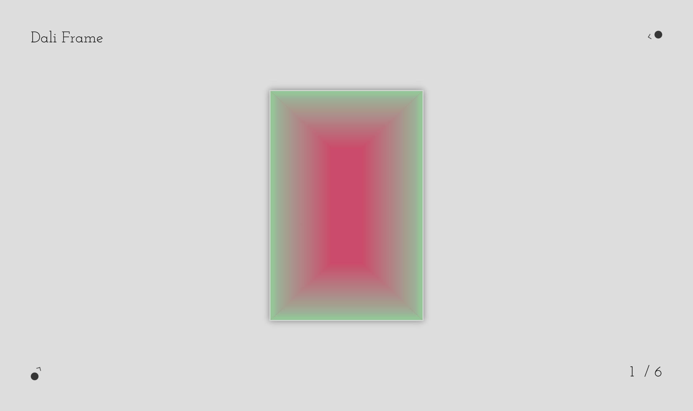

 

  

  <h3 align="center">Dali Frame</h3>

  

     
    <a href="https://github.com/othneildrew/Best-README-Template">View Demo</a>
    ·
    <a href="https://github.com/othneildrew/Best-README-Template/issues">Report Bug</a>
    ·
    <a href="https://github.com/othneildrew/Best-README-Template/issues">Request Feature</a>
  

### About The Project

This project is inspired by fantastic works from various artists like Wang Guangle. Thus I attempt to replicate these aesthetic moments with HTML, CSS and JavaScript. As a gallery, it will be a showcase of stunning visual effects achievable in frontend development.

### Installation

Run this demo on a [local server](https://developer.mozilla.org/en-US/docs/Learn/Common_questions/Tools_and_setup/set_up_a_local_testing_server).

### Preview

### Contact

Author: [jerome200069@outlook.com](mailto:jerome200069@outlook.com)

Demo Link: [https://github.com/your_username/repo_name](https://github.com/your_username/repo_name)

### License

[MIT](LICENSE)
